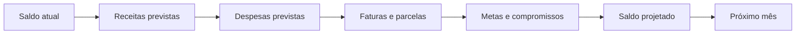
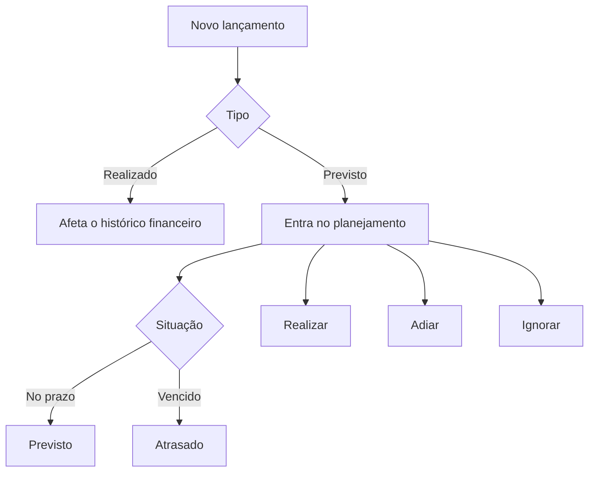
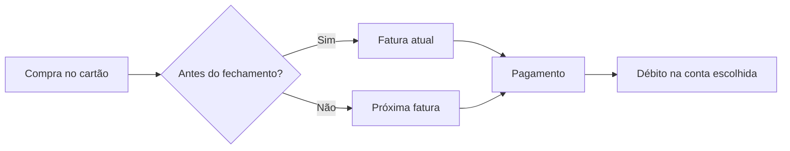
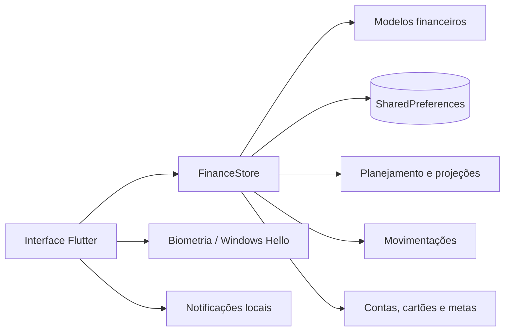

<div align="center">

# 💰 Finora

### Seu Financial OS para organizar gastos, receitas, cartões, metas e planejamento financeiro em um só lugar.


[](https://github.com/VictorAms12/finora/actions/workflows/build-android.yml)
[](https://github.com/VictorAms12/finora/actions/workflows/build-windows.yml)

**Offline-first • Multiplataforma • Focado em planejamento financeiro pessoal**

</div>

---

## 📖 Sobre o projeto

**Finora** é um aplicativo de gestão financeira pessoal desenvolvido em Flutter para centralizar a vida financeira sem exigir conta online ou conexão permanente com a internet.

O projeto nasceu como um organizador de entradas e saídas e evoluiu para um **Financial OS**: além de registrar movimentações, o app acompanha contas, cartões, faturas, metas, reservas, investimentos, orçamentos e projeções mensais.

A proposta é organizar o ciclo financeiro pessoal completo:

**registrar → planejar → acompanhar → projetar → melhorar**.

Os dados permanecem armazenados localmente no dispositivo, permitindo que o Finora continue funcional mesmo offline.

> Versão atual: **0.3.6 — Android + Windows**

---

## ✨ Destaques

| Área | O que o Finora entrega |
|---|---|
| 🏠 **Início** | Saldo, disponível para gastar, projeções, metas, compromissos e resumo do mês |
| 💸 **Movimentações** | Receitas, despesas, transferências, filtros, pesquisa, recorrências e parcelamentos |
| 🗓️ **Planejamento** | Orçamentos, lançamentos previstos, atrasos, projeções e navegação entre meses |
| 💳 **Cartões** | Limite, fechamento, vencimento, faturas, parcelas futuras e pagamento por conta |
| 🎯 **Metas** | Valor-alvo, progresso, prazo e estimativa mensal necessária |
| 🛟 **Reservas** | Reserva financeira com estimativa de cobertura em meses |
| 📈 **Investimentos** | Cadastro e acompanhamento de patrimônio investido |
| 📊 **Relatórios** | Comparações mensais, histórico e distribuição de gastos |
| 🔐 **Segurança** | Biometria no Android e Windows Hello quando disponível |
| 🎨 **Experiência** | Light/Dark Mode, OLED, layout responsivo e interface mobile/desktop |

---

## 🧠 Dashboard e projeções mensais

O Dashboard muda de contexto de acordo com o período selecionado.

No mês atual, o foco é mostrar quanto ainda está disponível para gastar. Em meses futuros, o Finora prioriza o saldo projetado. Em meses anteriores, o foco passa a ser o resultado e o fechamento do período.

O seletor de mês afeta as principais áreas financeiras do aplicativo, permitindo analisar:

- entradas e saídas do período;
- lançamentos previstos;
- parcelas;
- recorrências;
- faturas de cartão;
- orçamento por categoria;
- resultado mensal;
- projeções futuras.



A projeção é encadeada para que meses futuros possam utilizar o fechamento projetado do mês anterior como referência.

---

## ➕ Central de lançamentos

O botão central **+** funciona como uma central para registrar e organizar a vida financeira.

As principais ações são **Despesa** e **Receita**, acompanhadas por atalhos para:

- transferência;
- lançamento previsto;
- orçamento;
- meta;
- reserva;
- investimento;
- conta;
- cartão;
- categoria.

No Windows, a central possui apresentação adaptada para desktop e também pode ser aberta pelo atalho:

```text
Ctrl + N
```

---

## 💸 Movimentações, recorrências e parcelamentos

Cada movimentação pode conter informações como:

- tipo: receita ou despesa;
- valor;
- conta ou cartão;
- categoria;
- data;
- observação;
- recorrência;
- parcelamento.

O Finora diferencia lançamentos efetivos de compromissos planejados.



Os lançamentos previstos podem assumir os estados:

- **Previsto**;
- **Atrasado**;
- **Realizado**;
- **Ignorado**.

As recorrências podem ser semanais, mensais ou anuais, com duração indefinida, por quantidade ou até uma data definida.

Parcelamentos mantêm acompanhamento das parcelas atuais e futuras.

---

## 💳 Cartões e faturas

Os cartões possuem lógica própria para evitar que uma compra no crédito reduza imediatamente o saldo da conta bancária.

Cada cartão pode armazenar:

- nome;
- limite;
- dia de fechamento;
- dia de vencimento;
- conta padrão para pagamento.

As compras são direcionadas para a competência correta da fatura conforme a data da compra e o fechamento do cartão.

A tela de fatura permite acompanhar:

- fatura do mês selecionado;
- próxima fatura;
- limite disponível;
- parcelas futuras;
- compras que compõem a fatura;
- pagamento da fatura por uma conta.



---

## 🎯 Metas, reservas e investimentos

### Metas

As metas acompanham:

- valor desejado;
- valor acumulado;
- percentual concluído;
- prazo;
- valor restante;
- estimativa de contribuição mensal necessária.

### Reservas

As reservas ajudam a visualizar quanto tempo determinado valor conseguiria cobrir despesas mensais cadastradas.

### Investimentos

O Finora possui cadastro básico de investimentos para que o patrimônio financeiro possa ser acompanhado junto das demais contas e reservas.

A camada de investimentos ainda será ampliada nas próximas versões.

---

## 📊 Relatórios

Os relatórios utilizam o mês selecionado como referência e reúnem informações como:

- receitas;
- despesas;
- saldo;
- comparação com mês anterior;
- distribuição por categoria;
- histórico recente;
- projeções.

A proposta é transformar os próprios dados cadastrados em informação útil, sem depender de serviços externos.

---

## 🔔 Notificações

O Finora possui uma central interna para destacar acontecimentos financeiros relevantes, como:

- lançamentos atrasados;
- compromissos próximos;
- faturas;
- lembretes locais configurados no aparelho.

No Android, o projeto possui configuração nativa para notificações locais e permissões necessárias.

No Windows, notificações compatíveis podem ser utilizadas, mas alguns comportamentos dependem das limitações da versão portátil e da identidade do aplicativo no sistema.

---

## 🔐 Segurança

O aplicativo oferece bloqueio opcional de acesso:

- **Android:** biometria disponível no aparelho;
- **Windows:** Windows Hello quando suportado e configurado.

Ao sair do aplicativo ou retornar depois de ele ficar inativo, o Finora pode solicitar autenticação novamente.

> O bloqueio biométrico protege o acesso pela interface do aplicativo. Na versão atual, a persistência utiliza armazenamento local baseado em `SharedPreferences`; portanto, isso não deve ser interpretado como criptografia completa do banco financeiro em repouso.

---

## 🖥️ Android e Windows

A partir da v0.3.6, Android e Windows compartilham a mesma base Flutter.

### Android

A versão Android utiliza navegação inferior com botão central para novos lançamentos.

O pipeline gera automaticamente:

- APK para instalação direta;
- AAB para distribuição futura pela Play Store.

### Windows

Em telas largas, a interface utiliza navegação lateral e conteúdo centralizado.

Atalhos disponíveis:

| Atalho | Ação |
|---|---|
| `Ctrl + N` | Abrir central de lançamentos |
| `Ctrl + 1` | Início |
| `Ctrl + 2` | Planejamento |
| `Ctrl + 3` | Movimentações |
| `Ctrl + 4` | Mais |

O build Windows é distribuído atualmente como pacote portátil ZIP contendo o executável e suas dependências.

---

## 🎨 Interface e experiência

O Finora utiliza uma identidade visual baseada em superfícies neutras, preto OLED no tema escuro e detalhes em dourado.

A interface possui:

- tema claro;
- tema escuro OLED;
- animações de navegação;
- feedback visual de interação;
- cards compactos;
- layout responsivo;
- interface adaptada para mobile e desktop;
- opção de ocultar valores financeiros.

O objetivo é manter densidade de informação suficiente para um app financeiro sem transformar o Dashboard em um painel excessivamente carregado.

---

## 🏗️ Arquitetura

O Finora segue atualmente uma abordagem **offline-first**, com estado centralizado e persistência local.



O `FinanceStore` concentra o estado global e utiliza extensões especializadas para separar regras de movimentações, planejamento e entidades financeiras.

A arquitetura atual mantém os dados disponíveis imediatamente no dispositivo e prepara o projeto para uma futura camada de sincronização sem tornar a conexão obrigatória.

---

## 🧰 Tecnologias

| Tecnologia | Uso |
|---|---|
| **Flutter** | Interface e aplicação multiplataforma |
| **Dart** | Linguagem principal |
| **Provider** | Gerenciamento de estado |
| **SharedPreferences** | Persistência local atual |
| **local_auth** | Biometria e Windows Hello |
| **flutter_local_notifications** | Notificações e lembretes locais |
| **GitHub Actions** | CI e geração automática de builds |

Versão mínima do SDK Dart definida pelo projeto: **3.10.0**.

---

## 📁 Estrutura principal

```text
finora/
├── .github/
│   └── workflows/
│       ├── build-android.yml
│       └── build-windows.yml
├── lib/
│   ├── ui/                    # Telas, formulários e componentes
│   ├── main.dart              # Inicialização da aplicação
│   ├── models.dart            # Modelos financeiros
│   ├── store.dart             # Estado principal
│   ├── store_transactions.dart# Regras de movimentações
│   ├── store_planning.dart    # Planejamento e projeções
│   ├── store_entities.dart    # Contas, cartões, metas e entidades
│   ├── notification_service.dart
│   ├── security.dart          # Biometria e bloqueio
│   ├── onboarding.dart
│   └── theme.dart
├── pubspec.yaml
├── analysis_options.yaml
└── README.md
```

---

## 🚀 Executando o projeto

### Pré-requisitos

- Flutter Stable;
- Dart compatível com o `pubspec.yaml`;
- Android SDK para Android;
- Visual Studio com **Desktop development with C++** para build Windows.

### Clonar

```bash
git clone https://github.com/VictorAms12/finora.git
cd finora
```

### Instalar dependências

```bash
flutter pub get
```

### Executar

Android ou dispositivo conectado:

```bash
flutter run
```

Windows:

```bash
flutter run -d windows
```

---

## 📦 Builds de release

### Android

```bash
flutter build apk --release
flutter build appbundle --release
```

Saídas padrão:

```text
build/app/outputs/flutter-apk/app-release.apk
build/app/outputs/bundle/release/app-release.aab
```

### Windows

```bash
flutter build windows --release
```

O executável depende das DLLs e dos arquivos presentes na pasta `Release`. Para distribuição portátil, mantenha todo o conteúdo da pasta junto.

---

## ⚙️ CI com GitHub Actions

Pushes e pull requests direcionados à `main` executam pipelines independentes para **Android** e **Windows**.

Fluxo geral:

```text
Checkout
↓
Setup Flutter
↓
Geração da estrutura de plataforma
↓
flutter pub get
↓
flutter analyze
↓
Build Release
↓
Upload do artifact
```

O workflow Android gera APK e AAB. O workflow Windows compila a aplicação e empacota a distribuição portátil em ZIP.

Os resultados ficam disponíveis em:

**Actions → execução do workflow → Artifacts**.

---

## 🔐 Dados e privacidade

Na v0.3.6, os dados financeiros são armazenados localmente no dispositivo.

Isso significa que:

- o aplicativo funciona offline;
- não existe conta obrigatória;
- não existe envio automático de dados financeiros para um servidor;
- Android e Windows mantêm bases locais independentes;
- limpar os dados do aplicativo pode apagar as informações armazenadas;
- sincronização e backup em nuvem ainda não fazem parte desta versão.

---

## ⚠️ Limitações atuais

- sincronização Android ↔ Windows ainda não está disponível;
- não há backup automático em nuvem;
- a persistência ainda utiliza `SharedPreferences` em vez de um banco local transacional dedicado;
- investimentos possuem acompanhamento básico;
- não existe integração bancária/Open Finance;
- não existe importação OFX/CSV nesta versão;
- notificações no Windows portátil possuem limitações de integração com o sistema;
- ainda não há instalador MSIX/Setup oficial para Windows.

---

## 🛣️ Roadmap

### Próximos passos planejados

- [ ] migrar a persistência para banco local robusto;
- [ ] backup e restauração;
- [ ] exportação CSV/JSON;
- [ ] sincronização segura Android ↔ Windows;
- [ ] pareamento entre dispositivos por QR Code ou código;
- [ ] faturas de cartão com estados aberta, fechada, paga e atrasada;
- [ ] recorrências permanentes baseadas em regras;
- [ ] relatórios e gráficos avançados;
- [ ] histórico detalhado de aportes em metas e reservas;
- [ ] investimentos com rendimento, preço médio e eventos;
- [ ] busca global e filtros avançados;
- [ ] importação OFX/CSV;
- [ ] notificações financeiras mais inteligentes;
- [ ] instalador MSIX/Setup para Windows;
- [ ] melhorias contínuas de desempenho, acessibilidade e UX.

---

## 🧪 Qualidade

Antes dos builds de release, os workflows executam análise estática do projeto:

```bash
flutter analyze --no-fatal-infos
```

A versão 0.3.6 possui pipelines separados de Android e Windows através do GitHub Actions, permitindo validar as duas plataformas sem depender de compilação manual no ambiente de desenvolvimento.

---

## 👨‍💻 Autor

Desenvolvido e mantido por **VictorAms12**.

GitHub: [@VictorAms12](https://github.com/VictorAms12)

---

<div align="center">

**Finora** — controle financeiro que acompanha não apenas o que você gastou, mas também o que vem pela frente.

</div>
