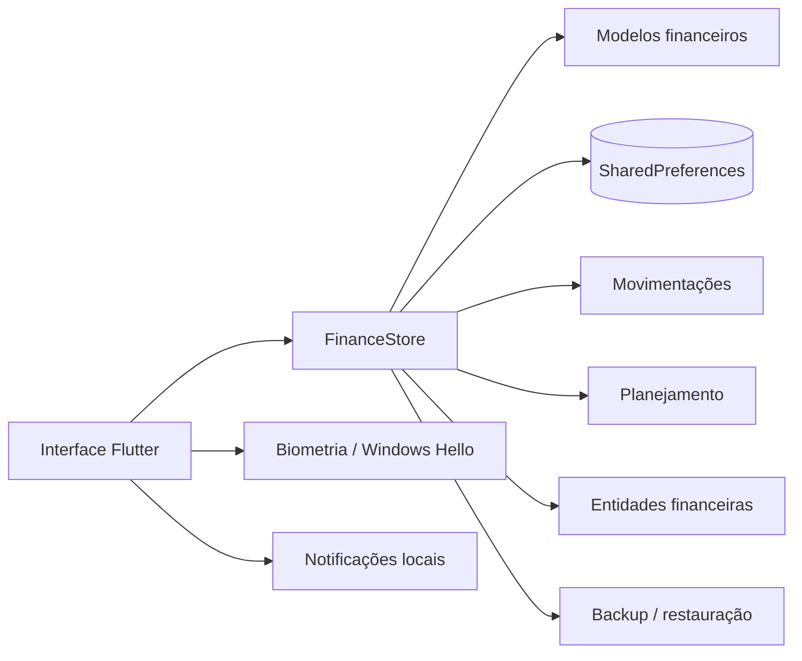

<div align="center">

# Finora

### Gestão financeira pessoal offline-first para Android e Windows


[](https://github.com/VictorAms12/finora/actions/workflows/build-android.yml)
[](https://github.com/VictorAms12/finora/actions/workflows/build-windows.yml)

**Offline-first · Android + Windows · Planejamento financeiro pessoal**

</div>

---

## Sobre

O **Finora** é um aplicativo Flutter para registrar, planejar e acompanhar a vida financeira sem exigir conta online ou conexão permanente com a internet.

A aplicação reúne em uma única base local:

- contas e saldos;
- receitas, despesas e transferências;
- cartões, compras e faturas;
- lançamentos previstos e recorrências;
- parcelamentos;
- orçamentos por categoria;
- metas e reservas;
- investimentos;
- relatórios e projeções mensais.

> Versão atual: **0.3.8**

---

## Principais recursos

| Área | Recursos |
|---|---|
| **Dashboard** | saldo, disponível para gastar, projeções e visão do mês |
| **Movimentações** | receitas, despesas, transferências, pesquisa, filtros e edição |
| **Planejamento** | previstos, atrasos, recorrências, parcelamentos e projeções |
| **Cartões** | limite, fechamento, vencimento, compras, parcelas e faturas |
| **Orçamentos** | acompanhamento mensal por categoria |
| **Metas e reservas** | progresso, prazo, cobertura e aportes |
| **Investimentos** | acompanhamento básico do patrimônio investido |
| **Relatórios** | comparação mensal, histórico e distribuição de gastos |
| **Backup** | exportação completa copiável e restauração dos dados |
| **Segurança** | biometria no Android e Windows Hello quando disponível |
| **Experiência** | temas claro/escuro/OLED e layout adaptado a mobile e desktop |

### Salário no 5º dia útil

O Finora permite programar uma receita salarial recorrente para o **5º dia útil de cada mês**. O cálculo considera segunda a sexta-feira; feriados podem ser ajustados manualmente no lançamento previsto.

### Lançamentos futuros

Receitas e despesas com data futura permanecem como planejamento e **não alteram o saldo atual antes de serem realizadas**.

---

## Backup e recuperação

A partir da v0.3.8, o Finora possui backup completo pelo próprio aplicativo.

O backup inclui, entre outros:

- contas;
- cartões;
- transações;
- previstos;
- recorrências;
- orçamentos;
- metas;
- reservas;
- investimentos;
- preferências relevantes.

Em **Configurações → Backup e recuperação** é possível copiar um backup completo e restaurá-lo posteriormente.

> O armazenamento principal ainda é local. Faça backup antes de limpar dados, desinstalar o aplicativo ou trocar de dispositivo.

---

## Android e Windows

### Android

A interface utiliza navegação otimizada para celular, central de lançamentos e suporte a biometria e notificações locais.

A pipeline Android valida o projeto e pode gerar:

- APK de release;
- AAB de release.

Artifacts instaláveis só são publicados quando uma **chave de assinatura estável** está configurada por GitHub Secrets. Consulte [`docs/SIGNING.md`](docs/SIGNING.md).

### Windows

Em telas largas, o Finora utiliza navegação lateral e conteúdo responsivo.

Atalhos principais:

| Atalho | Ação |
|---|---|
| `Ctrl + N` | central de lançamentos |
| `Ctrl + 1` | início |
| `Ctrl + 2` | planejamento |
| `Ctrl + 3` | movimentações |
| `Ctrl + 4` | mais |

A distribuição atual é um pacote portátil ZIP contendo o executável e suas dependências.

---

## Arquitetura

O Finora segue uma abordagem **offline-first**, com estado centralizado em `FinanceStore` e persistência local.



### Estrutura principal

```text
finora/
├── .github/
│   ├── dependabot.yml
│   └── workflows/
│       ├── build-android.yml
│       └── build-windows.yml
├── docs/
│   ├── DEVELOPMENT.md
│   └── SIGNING.md
├── lib/
│   ├── ui/
│   ├── main.dart
│   ├── models.dart
│   ├── store.dart
│   ├── store_backup.dart
│   ├── store_entities.dart
│   ├── store_planning.dart
│   ├── store_transactions.dart
│   ├── notification_service.dart
│   ├── security.dart
│   ├── onboarding.dart
│   └── theme.dart
├── test/
├── tool/
│   ├── configure_android.py
│   ├── configure_windows.ps1
│   └── generate_branding.py
├── CHANGELOG.md
├── analysis_options.yaml
├── pubspec.yaml
└── README.md
```

---

## Tecnologias

| Tecnologia | Uso |
|---|---|
| **Flutter** | aplicação multiplataforma |
| **Dart** | linguagem principal |
| **Provider** | gerenciamento de estado |
| **SharedPreferences** | persistência local atual |
| **local_auth** | biometria e Windows Hello |
| **flutter_local_notifications** | notificações locais |
| **GitHub Actions** | CI e geração de builds |
| **Dependabot** | atualização assistida de dependências |

SDK Dart mínimo definido pelo projeto: **3.10.0**.

---

## Desenvolvimento

### Pré-requisitos

- Flutter Stable;
- Android SDK + Java 17 para Android;
- Visual Studio com **Desktop development with C++** para Windows.

### Preparação

```bash
git clone https://github.com/VictorAms12/finora.git
cd finora
flutter pub get
```

### Executar

```bash
flutter run
```

Windows:

```bash
flutter run -d windows
```

### Validar

```bash
flutter analyze --no-fatal-infos
flutter test
```

Mais detalhes em [`docs/DEVELOPMENT.md`](docs/DEVELOPMENT.md).

---

## CI

Pushes e Pull Requests para `main` executam pipelines independentes para Android e Windows.

Fluxo resumido:

```text
Checkout
↓
Setup Flutter
↓
Gerar plataforma nativa
↓
Aplicar configuração em tool/
↓
flutter pub get
↓
flutter analyze
↓
flutter test
↓
Build release
```

A versão dos artifacts é derivada automaticamente do `pubspec.yaml`, evitando duplicação de números de versão dentro dos workflows.

---

## Dados e privacidade

Na versão atual:

- os dados financeiros permanecem localmente no dispositivo;
- não existe conta obrigatória;
- não há envio automático dos dados financeiros para servidor próprio;
- Android e Windows mantêm bases independentes;
- existe backup manual completo pelo aplicativo;
- sincronização entre dispositivos ainda não está disponível.

O bloqueio biométrico protege o acesso pela interface do Finora, mas a persistência atual em `SharedPreferences` não representa criptografia integral dos dados em repouso.

---

## Limitações atuais

- sincronização Android ↔ Windows ainda não disponível;
- persistência ainda baseada em `SharedPreferences`;
- investimentos possuem acompanhamento básico;
- não existe integração bancária/Open Finance;
- não existe importação OFX/CSV;
- notificações do Windows portátil possuem limitações de integração;
- ainda não existe instalador MSIX/Setup oficial.

---

## Roadmap

- [ ] migrar a persistência para banco local transacional, como SQLite/Drift;
- [ ] exportação estruturada CSV/JSON;
- [ ] sincronização segura Android ↔ Windows;
- [ ] pareamento entre dispositivos por QR Code ou código;
- [ ] importação OFX/CSV;
- [ ] relatórios e gráficos avançados;
- [ ] investimentos com rendimento, preço médio e eventos;
- [ ] instalador oficial para Windows;
- [ ] melhorias contínuas de desempenho, acessibilidade e UX.

O histórico de mudanças está em [`CHANGELOG.md`](CHANGELOG.md).

---

## Assinatura Android

Chaves privadas, senhas e certificados de assinatura não pertencem ao código-fonte. A configuração segura do projeto está documentada em [`docs/SIGNING.md`](docs/SIGNING.md).

---

## Autor

Desenvolvido e mantido por **VictorAms12**.

GitHub: [@VictorAms12](https://github.com/VictorAms12)

---

<div align="center">

**Finora — controle financeiro atual, planejamento do que vem pela frente.**

</div>
